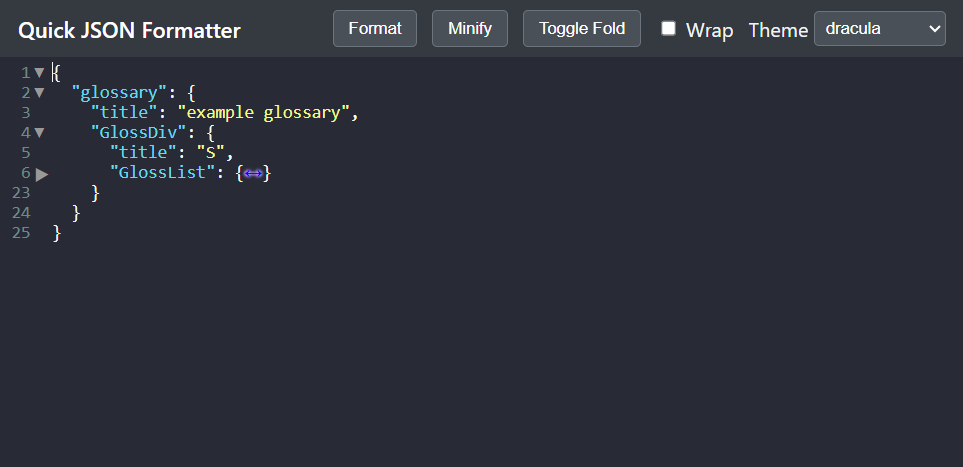

# Online-json-formatter

Clone of https://jsonformatter.org/. But lighter, without ads and less distractions.

Demo : https://logantann.github.io/online-json-formatter/

Features : 
- Minify or format a pasted json document.
- Auto-formats when a json file is pasted
- Auto-folds after two levels of depthness. 

 
